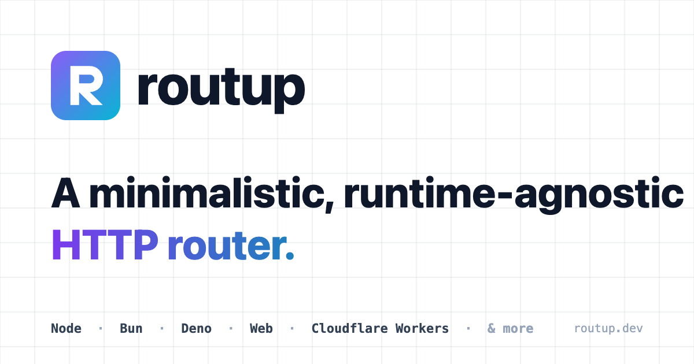

<div align="center">

[](https://routup.net)

</div>

# Routup 🧙‍

[](https://badge.fury.io/js/routup)
[](https://github.com/Tada5hi/routup/actions/workflows/main.yml)
[](https://codecov.io/gh/tada5hi/routup)
[](https://snyk.io/test/github/Tada5hi/routup)
[](https://conventionalcommits.org)

**Routup** is a lightweight, runtime agnostic and extendable routing framework.
It uses node's vanilla request and response interfaces, which are injected into route handlers aka middlewares as function argument.

Helpers provide additional functionalities to transform and interact with the request and manipulate the response upstream.

**Table of Contents**

- [Installation](#installation)
- [Features](#features)
- [Documentation](#documentation)
- [Usage](#usage)
- [Plugins](#plugins)
- [Contributing](#contributing)
- [License](#license)

## Installation

```bash
npm install routup --save
```

## Features

- 🚀 runtime agnostic (Node.JS, Bun, Deno, ...)
- 🧰 response & request composables/helpers
- 💼 extendable & compact
- 🛫 named route parameters
- 📁 nestable routers
- 🤝️ define one or many (error-) middlewares
- ✨ promise support for route- & middleware-handlers
- 👕 TypeScript fully supported
- 🤏 Minimalistic to fit into any solution with minimum overhead
- & much more

## Documentation

To read the docs, visit [https://routup.net](https://routup.net)

## Usage

**`NodeJs`**

```typescript
import { createServer } from 'node:http';
import {
    createNodeListener,
    Router, 
    send
} from 'routup';

const router = new Router();

router.get('/', () => 'Hello World');

const server = createServer(createNodeListener(router));
server.listen(3000)
```

**`Bun`**

```typescript
import {
    dispatchWebRequest,
    Router, 
    send
} from 'routup';

const router = new Router();

router.get('/', () => 'Hello World');

Bun.serve({
    async fetch(request) {
        return dispatchWebRequest(router, request);
    },
    port: 3000,
});
```

**`Deno`**

```typescript
import {
    dispatchWebRequest,
    Router,
    send
} from 'routup';

const router = new Router();

router.get('/', () => 'Hello World');

const server = Deno.listen({
    port: 3000
});
for await (const conn of server) {
    const httpConn = Deno.serveHttp(conn);

    for await (const requestEvent of httpConn) {
        const response = await dispatchWebRequest(
            router, 
            requestEvent.request
        );
        requestEvent.respondWith(response);
    }
}
```

## Plugins

According to the fact that routup is a minimalistic framework, 
it depends on [plugins](https://github.com/routup/plugins) to cover some 
typically http framework functions, which are not integrated in the main package.

| Name                                                                       | Description                                                            |
|----------------------------------------------------------------------------|------------------------------------------------------------------------|
| [body](https://www.npmjs.com/package/@routup/body)                         | Read and parse the request body.                                       |
| [cookie](https://www.npmjs.com/package/@routup/cookie)                     | Read and parse request cookies and serialize cookies for the response. |
| [decorators](https://www.npmjs.com/package/@routup/decorators)             | Create request handlers with class-, method- & parameter-decorators.   |
| [prometheus](https://www.npmjs.com/package/@routup/prometheus)             | Collect and serve metrics for prometheus.                              |
| [query](https://www.npmjs.com/package/@routup/query)                       | Read and parse the query string of the request url.                    |
| [rate-limit](https://www.npmjs.com/package/@routup/rate-limit)             | Rate limit incoming requests.                                          |
| [rate-limit-redis](https://www.npmjs.com/package/@routup/rate-limit-redis) | Redis adapter for the rate-limit plugin.                               |
| [static](https://www.npmjs.com/package/@routup/static)                     | Serve static files from a directory.                                   |
| [swagger](https://www.npmjs.com/package/@routup/swagger)                   | Serve generated docs from URL or based on a JSON file.                 |
## Contributing

Before starting to work on a pull request, it is important to review the guidelines for
[contributing](./CONTRIBUTING.md) and the [code of conduct](./CODE_OF_CONDUCT.md).
These guidelines will help to ensure that contributions are made effectively and are accepted.

## License

Made with 💚

Published under [MIT License](./LICENSE).
