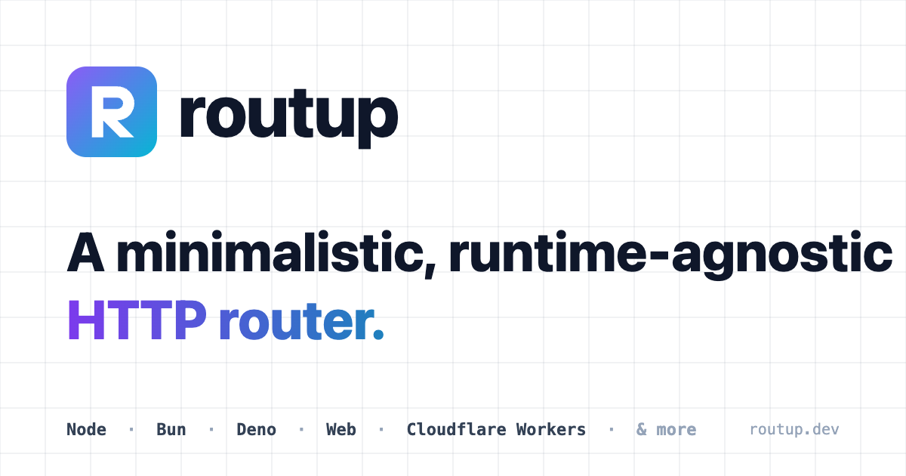

<div align="center">

[](https://routup.net)

</div>

# Routup 🧙‍

[](https://badge.fury.io/js/routup)
[](https://github.com/Tada5hi/routup/actions/workflows/main.yml)
[](https://codecov.io/gh/tada5hi/routup)
[](https://snyk.io/test/github/Tada5hi/routup)
[](https://conventionalcommits.org)

**Routup** is a minimalistic, runtime-agnostic HTTP routing framework for Node.js, Bun, Deno, and Cloudflare Workers.
Handlers return values directly — routup converts them to Web `Response` objects automatically.

**Table of Contents**

- [Installation](#installation)
- [Features](#features)
- [Documentation](#documentation)
- [Usage](#usage)
- [Plugins](#plugins)
- [Contributing](#contributing)
- [License](#license)

## Installation

```bash
npm install routup --save
```

## Features

- 🚀 **Runtime agnostic** — Node.js, Bun, Deno, Cloudflare Workers
- 📝 **Return-based handlers** — return strings, objects, streams, or `Response` directly
- ✨ **Async middleware** — onion model with `event.next()`
- 📌 **Lifecycle hooks** — `request`, `response`, `error` for cross-cutting concerns
- 🔌 **Plugin system** — extend with reusable, installable plugins
- 🧰 **Tree-shakeable helpers** — import only what you use
- 📁 **Nestable routers** — modular route composition
- 👕 **TypeScript first** — fully typed API with generics
- 🤏 **Minimal footprint** — small core, no bloat

## Documentation

To read the docs, visit [https://routup.net](https://routup.net)

## Usage

### Handlers

Handlers receive a `DispatchEvent` and return a value. Routup converts the return value to a Web `Response` automatically.

**Shorthand**

```typescript
import { Router, coreHandler, errorHandler, serve } from 'routup/node';

const router = new Router();

router.get('/', coreHandler(() => 'Hello, World!'));
router.get('/greet/:name', coreHandler((event) => `Hello, ${event.params.name}!`));
router.use(errorHandler((error) => ({ error: error.message })));

serve(router, { port: 3000 });
```

**Verbose**

```typescript
import { Router, coreHandler, serve } from 'routup/node';

const router = new Router();

router.use(coreHandler({
    path: '/',
    method: 'GET',
    fn: () => 'Hello, World!',
}));

router.use(coreHandler({
    path: '/greet/:name',
    method: 'GET',
    fn: (event) => `Hello, ${event.params.name}!`,
}));

serve(router, { port: 3000 });
```

### Return Values

| Return type | Response |
|-------------|----------|
| `string` | `text/plain` |
| `object` / `array` | `application/json` |
| `Response` | Passed through as-is |
| `ReadableStream` | Streamed to client |
| `Blob` | Sent with blob's content type |
| `null` | `204 No Content` |

### Middleware

Middleware calls `event.next()` to continue the pipeline:

```typescript
router.use(coreHandler(async (event) => {
    console.log(`${event.method} ${event.path}`);
    return event.next();
}));
```

### Runtimes

Routup runs on any JavaScript runtime:

**Node.js**
```typescript
import { Router, coreHandler, serve } from 'routup/node';

const router = new Router();
router.get('/', coreHandler(() => 'Hello, World!'));
serve(router, { port: 3000 });
```

**Bun**
```typescript
import { Router, coreHandler, serve } from 'routup/bun';

const router = new Router();
router.get('/', coreHandler(() => 'Hello, World!'));
serve(router, { port: 3000 });
```

**Deno**
```typescript
import { Router, coreHandler, serve } from 'routup/deno';

const router = new Router();
router.get('/', coreHandler(() => 'Hello, World!'));
serve(router, { port: 3000 });
```

**Cloudflare Workers**
```typescript
import { Router, coreHandler } from 'routup/cloudflare';

const router = new Router();
router.get('/', coreHandler(() => 'Hello, World!'));

export default { fetch: (request) => router.fetch(request) };
```

## Plugins

Routup is minimalistic by design. [Plugins](https://github.com/routup/plugins) extend the framework with additional functionality.

| Name | Description |
|------|-------------|
| [assets](https://github.com/routup/plugins/tree/master/packages/assets) | Serve static files from a directory |
| [basic](https://github.com/routup/plugins/tree/master/packages/basic) | Bundle of body, cookie, and query plugins |
| [body](https://github.com/routup/plugins/tree/master/packages/body) | Read and parse the request body |
| [cookie](https://github.com/routup/plugins/tree/master/packages/cookie) | Read and parse request cookies |
| [decorators](https://github.com/routup/plugins/tree/master/packages/decorators) | Class, method, and parameter decorators |
| [prometheus](https://github.com/routup/plugins/tree/master/packages/prometheus) | Collect and serve Prometheus metrics |
| [query](https://github.com/routup/plugins/tree/master/packages/query) | Parse URL query strings |
| [rate-limit](https://github.com/routup/plugins/tree/master/packages/rate-limit) | Rate limit incoming requests |
| [rate-limit-redis](https://github.com/routup/plugins/tree/master/packages/rate-limit-redis) | Redis adapter for rate-limit |
| [swagger](https://github.com/routup/plugins/tree/master/packages/swagger) | Serve Swagger/OpenAPI docs |

## Benchmarks

* CPUs:  `24`
* RAM:  `63.9GB`
* Node: `v18.16.0`
* Date:  `Wed Sep 13 2023 15:11:58 GMT+0200 (Mitteleuropäische Sommerzeit) `
* Method: `autocannon -c 100 -d 40 -p 10 localhost:3000` (two rounds; one to warm-up, one to measure)

| Package    | Requests/s  | Latency (ms) | Throughput/MB |
|:-----------|:-----------:|-------------:|--------------:|
| http       |    61062    |        15.87 |         10.89 |
| fastify    |    59679    |        16.26 |         10.70 |
| koa        |    45763    |        21.35 |          8.16 |
| **routup** |    44588    |        21.91 |          9.02 |
| hapi       |    41374    |        23.67 |          7.38 |
| express    |    13376    |        74.18 |          2.39 |

Benchmarks were generated using autocannon.
To recreate the results, this can be done using the [benchmarks'](https://github.com/routup/benchmarks) repository.

## Contributing

Before starting to work on a pull request, it is important to review the guidelines for
[contributing](./CONTRIBUTING.md) and the [code of conduct](./CODE_OF_CONDUCT.md).
These guidelines will help to ensure that contributions are made effectively and are accepted.

## License

Made with 💚

Published under [MIT License](./LICENSE).
